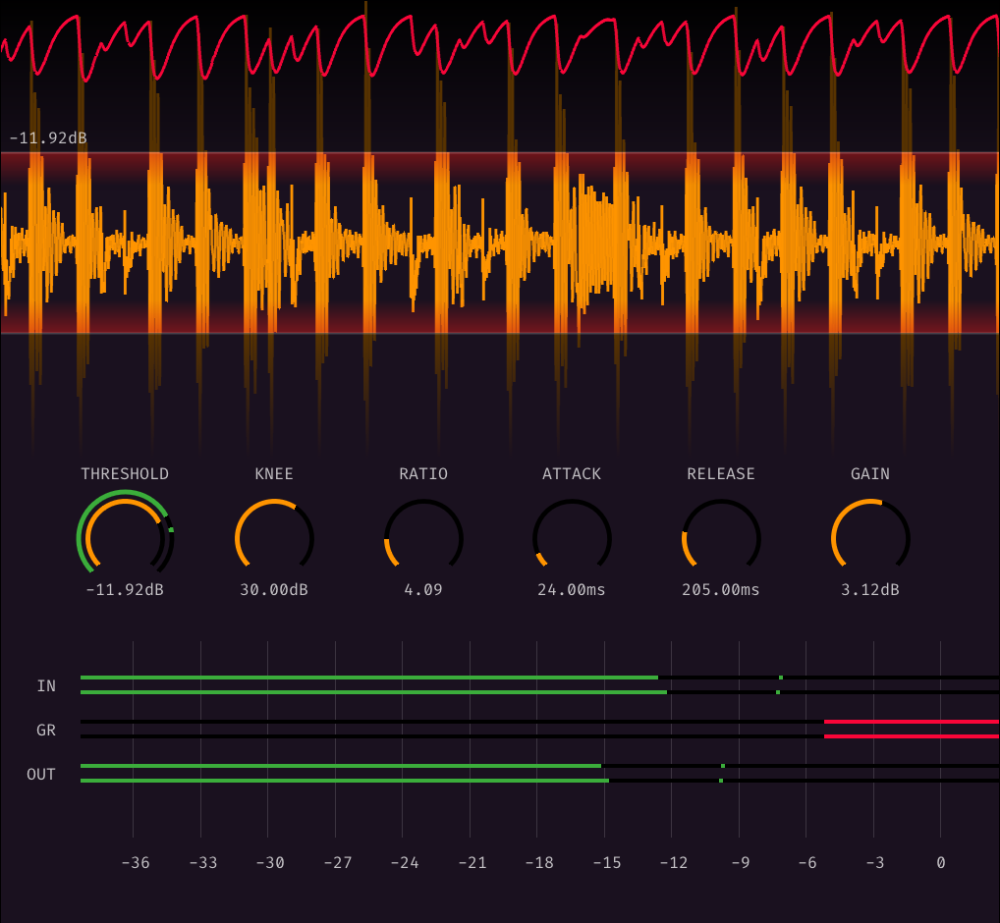

# rust-imgui-compressor-plugin
A compressor vst plugin in rust, using imgui.

The plugin logs events to `~/tmp/IMGUIBaseviewCompressor.log`.

## Usage: macOS (Untested)

- Run `scripts/macos-build-and-install.sh`
- Start your DAW, test the plugin

## Usage: Windows

- Run `cargo build`
- Copy `target/debug/libbaseview_test_vst2.dll` to your VST plugin folder
- Start your DAW, test the plugin

## Usage: Linux (Untested)

- Run `cargo build`
- Copy `target/debug/libbaseview_test_vst2.so` to your VST plugin folder
- Start your DAW, test the plugin

